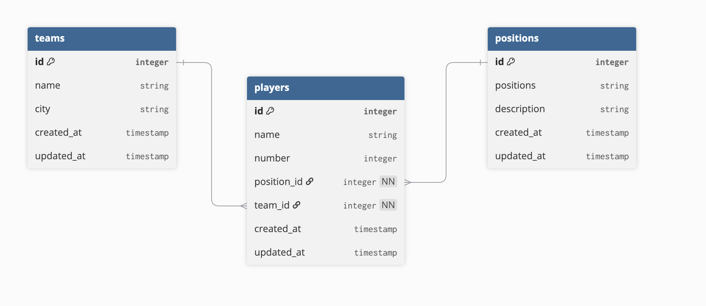

# NFL CLI Manager

A full CRUD Command-Line application with animations that lets you manage and create NFL teams and players. All data is current for the 2025-2026 NFL season.

## What This App Does

This application allows you to:

- **View all NFL teams** and their players
- **Create new teams** and add them to the league
- **Create new players** and assign them to teams
- **Update team information** (like moving team locations)
- **Trade players** between teams
- **Delete teams and players** from the system
- **Search for players** by name
- **View position information** and player statistics

The app uses a simple menu-driven interface with arrow key navigation, making it easy to manage your NFL data.

## How to Clone and Run

### Prerequisites

- Ruby (version 3.0 or higher)
- Git

### Step 1: Clone the Repository

```bash
git clone git@github.com:nkp521/NFL-CLI.git
cd NFL-CLI
```

### Step 2: Install Dependencies

```bash
bundle install
```

### Step 3: Reset Database (if needed)

```bash
rake db:reset
```

### Step 4: Start the Server

```bash
bundle exec rackup -p 9292
```

The server will run on `http://localhost:9292`

### Step 5: Run the CLI Application

Open a new terminal window and run:

```bash
ruby cli/main.rb
```

## How to Use

1. Make sure the server is running on port 9292
2. Run the CLI application
3. Use the arrow keys to navigate the menu
4. Press Enter to select an option
5. Follow the prompts to manage your teams and players

## Features

- **Interactive Menu**: Navigate with arrow keys
- **Real-time Data**: All changes are saved to the database
- **Current Roster Data**: Includes all 2025-2026 NFL season teams and players
- **Team and Roster Management**: Complete control over team rosters and players
- **Position Management**: View detailed information about all NFL positions
- **Search Functionality**: Find players by name across all teams
- **Error Handling**: Clear error messages and validation

## Project Structure

```
NFL-CLI/
├── cli/                   # Command-line interface
│   ├── main.rb            # Main entry point
│   ├── api_client/        # API communication
│   └── interface/         # User interface components
├── app/                   # Backend application
│   ├── controllers/       # API endpoints
│   └── models/            # Database models
├── db/                    # Database files and migrations
└── config/                # Application configuration
```

Enjoy managing your NFL teams and players!

## Database Structure


